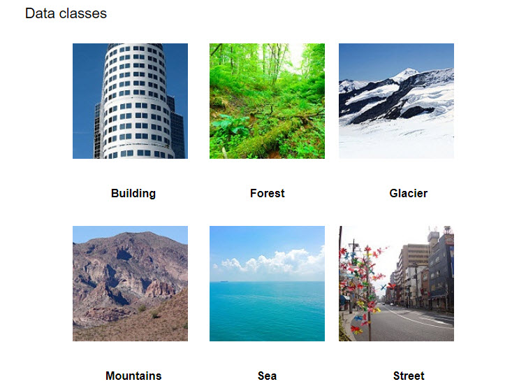
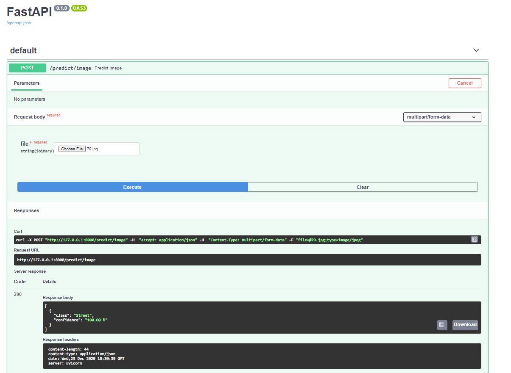

# Multiclass Image classification
There has been a tremendous increase in the applications of computer vision. The applications of CV range from smart cameras and video surveillance to robotics, transportation and more. Idea here is to build a powerful Neural network that can classify these images with more accuracy. This is a multiclass image classification API which classify the images into 'Buildings', 'Sea', 'Glacier', 'Mountain', 'Forest' and 'Street'. 



## Technologies 
This project is build using [Tensorflow](https://www.tensorflow.org/) deep learning libraries and deployed using [Fastapi](https://fastapi.tiangolo.com/). The requirement for this project can be found in the [requirements](./requirements.txt) file.

# Getting Started
These instructions will get you a copy of the project up and running on your local machine for development and testing purposes.

## Setup or Installation
To use this project just download the project and install all the dependency mention in the [requirements](./requirements.txt) file. All the package can be installed using below command:

```
pip install -r requirements.txt
```
Now run the [main.py](./main.py) file to run the project:

```
python main.py
```
Then you can access the API using Fastapi swagger UI  [here](http://127.0.0.1:8000/docs#/default/predict_image_predict_image_post). This UI can be used to run and explore some initial test on the API and the output of test will be shown as below:




Also you can directly used the end point by calling the post method to [URL](http://127.0.0.1:8000/docs#/default/predict_image_predict_image_post). 


## Running automated test
This project also contains the test scrip file [test.py](./test.py) to run the automated test on large data set. This file takes an file path as an input. We just have to enter file name to run the file:

```
python test.py
```

To run the script for the upload file should contain 6 different path for each class for tagged data similar to this example [file](./test_scripts/testdata.txt). 

The script then creates an CSV file with filename, Original data class, predicted data class and probability similar to [this file](./test_scripts/Prediction_labeled_03012021_122138.csv). This script also writes the test accuracy to the log to the log file [test_log.txt ](./log/test_log.txt)


## Running Bulk prediction 
This project also contains the predict scrip file [predict.py](./predict.py) to run the bulk predictions on large data set. This file takes an file path as an input. We just have to enter file name to run the file:

```
python predict.py
```

To run the script for tagged data the upload file should contain the single path for the new data similar to [this file](./test_scripts/newdata.txt).  

The script then creates an CSV file with filename, predicted data class and probability similar to [this file](./test_scripts/Prediction_New_03012021_123842.csv).

## Model Training 
The model training is done in juypter notebook which can be accessed [here](./model%20Training/Image%20classification%20v2.1.ipynb). I have used VGG16 model for transfer learning with Feature extraction technique to train the last few layers of the model on our data to get the correct predictions.

I have also created and script [train.py](./train.py) to train a new model if we want to retrain the model or we have new data. We just have to enter file name to run the file:

```
python train.py
```

To run the script for we have to upload file a file which should contain 1 path for tagged data divided into folder for each class. This script writes the train log to the log file [train_log.txt ](./log/train_log.txt)